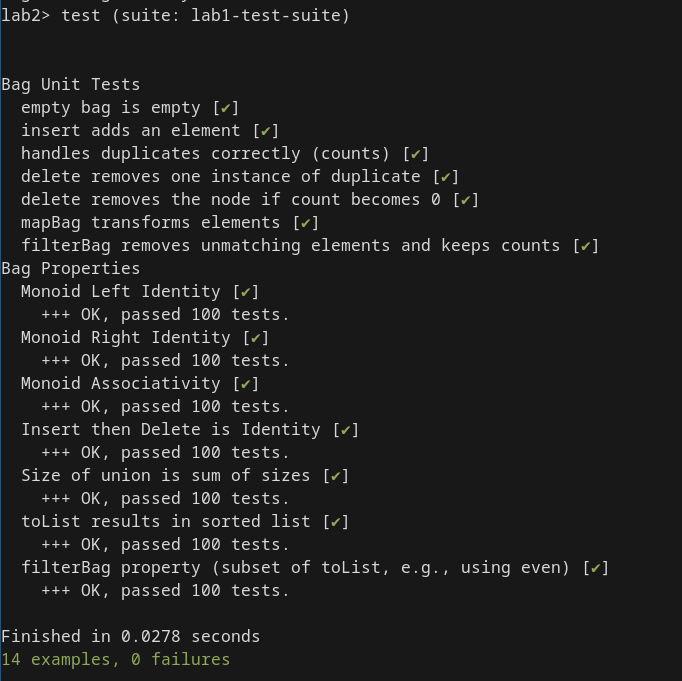

# Лабораторная работа 2
 - Выполнил: Думцев Виктор Сергеевич
 - Вариант: bt-bag
 - Группа: P3312

# Реализация
Код находится в файле src/Bag.hs, перекопировать его сюда не вижу смысла. Из комментариев - 
1. Просто сравнить структуру деревьев не выйдет, так как она зависит от порядка вставки элементов в Bag. Я сделал вспомогательную функцию для перевода в список из элементов вида (значение, счётчик) и сравнение спсиков этих элементов
2. Сделать Bag инстансом Functor чтобы получить mapBag не выйдет, так как в сигнатуре Functor От элементов не требуется сравнимость, а мне нужен Ord для сравнения элементов.
3. Использована вспомогательная функция combine, которая работает на предположении что любой элемент в первом аргументе(Bag) меньше любого элемента в правом(тоже Bag), и комбинирует деревья, беря самый левый элемент в правом поддереве(можно было сделать самый правый элемент в левом) и ставит его в корень. Эта функция использована в удалении, а также в фильтрации, в случае если элемент не соответствует предикату. 

# Тесты
Тесты находятся в test/spec.hs , там в комментариях всё написано. В основном - просто задаю правило генерации случайных деревьев, провожу пару юнит тестов с конкретными значениями чтобы проверить что вставка корректна, и mapBag и filterBag работают. Затем набор property тестов для проверки свойств моноида - левой и правой единицы и ассоциативности. Также простестил корректность вставки элементов и фильтрации. 

